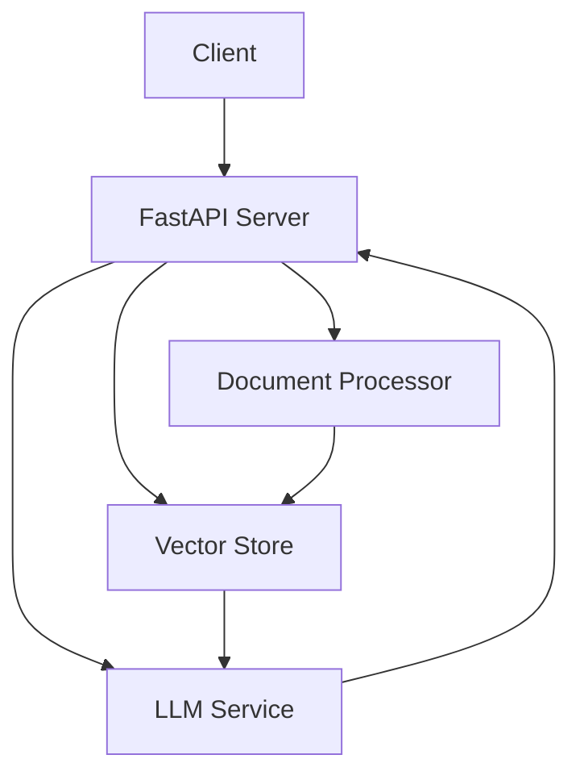

# Document Q&A Service

A FastAPI service that enables question-answering over PDF documents using Google's Gemini 2.5 Flash model and vector search.

## Features

- PDF document processing and chunking using PyMuPDF
- Semantic search with ChromaDB vector store
- Q&A using Gemini 2.5 Flash for accurate, context-aware responses
- Structured JSON responses with source page citations
- FastAPI endpoints with automatic OpenAPI documentation
- Pydantic models for request/response validation

## Setup

1. Install dependencies using Poetry:
```bash
poetry install
```

2. Set up environment variables:
```bash
# Create .env file
cp .env.example .env

# Add your Google Cloud Project ID
GOOGLE_CLOUD_PROJECT=your-project-id
```

3. Set up Google Cloud credentials:
```bash
# Set up application default credentials
gcloud auth application-default login
```

## Usage

1. Start the server:
```bash
poetry run uvicorn backend.src.api.app:app --reload
```

2. Upload a document:
```bash
curl -X POST "http://localhost:8000/documents/upload" \
  -H "Content-Type: multipart/form-data" \
  -F "file=@/path/to/your.pdf"
```

Response:
```json
{
  "document_id": "uuid",
  "metadata": {
    "filename": "your.pdf",
    "total_pages": 10,
    "total_chunks": 25
  }
}
```

3. Ask questions:
```bash
curl -X POST "http://localhost:8000/chat" \
  -H "Content-Type: application/json" \
  -d '{
    "query": "What is the main topic?",
    "document_id": "uuid-from-upload"
  }'
```

Response:
```json
{
  "answer": "Detailed answer based on document content",
  "source_pages": [1, 2],
  "confidence": 0.95,
  "timestamp": "2025-05-17T11:41:14.123456"
}
```

## API Documentation

Once the server is running, visit:
- OpenAPI UI: http://localhost:8000/docs
- ReDoc UI: http://localhost:8000/redoc

## Architecture



### Components

1. **Document Processor**
   - Handles PDF parsing with PyMuPDF
   - Splits documents into semantic chunks
   - Extracts metadata and page information

2. **Vector Store**
   - Manages document chunks using ChromaDB
   - Performs semantic similarity search
   - Retrieves relevant context for queries

3. **LLM Service**
   - Integrates with Gemini 2.5 Flash
   - Generates accurate, context-aware responses
   - Formats responses with source citations

## Configuration

Key configuration options:

- **Location**: us-west1 (optimized for lower latency)
- **Model**: gemini-2.5-flash
- **Generation Parameters**:
  - temperature: 0.1 (focused, factual responses)
  - top_p: 0.8 (balanced token selection)
  - candidate_count: 1 (optimized for latency)

## Development

1. Install development dependencies:
```bash
poetry install --with dev
```

2. Run tests:
```bash
poetry run pytest
```

3. Format code:
```bash
poetry run black .
poetry run ruff .
```

4. Type checking:
```bash
poetry run mypy .
```

## License

MIT
