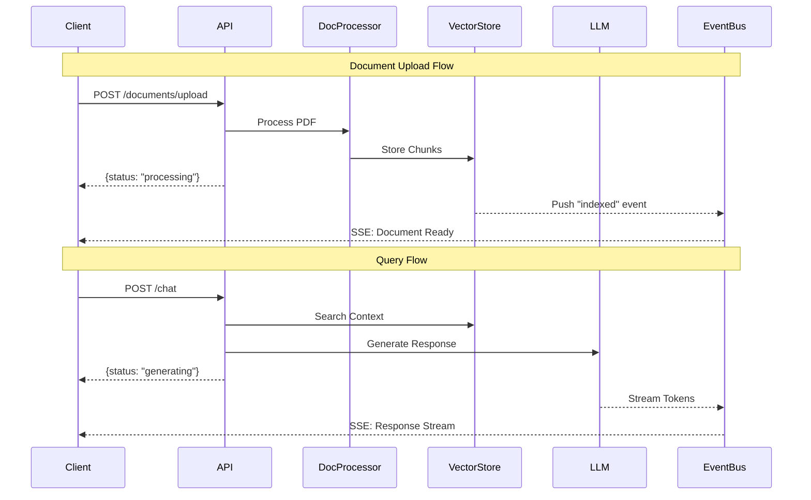

# Backend Service Documentation

## Overview

The backend service is a FastAPI-based application that enables interactive conversations with PDF documents using advanced language models and vector search technology. It implements an event-driven architecture with Server-Sent Events (SSE) for real-time streaming of responses.

### Architecture Diagram



## Components

### 1. Document Processor

The document processor handles PDF document ingestion and preparation for vector storage.

Key features:
- PDF text extraction using PyMuPDF
- Text cleaning and normalization
- Semantic chunking using LangChain
- Metadata preservation (page numbers, source info)

Configuration:
```python
DocumentProcessor(
    chunk_size=1000,    # Maximum size of text chunks
    chunk_overlap=200   # Overlap between chunks
)
```

### 2. Vector Store

The vector store manages document embeddings and similarity search using ChromaDB.

Key features:
- OpenAI embeddings (text-embedding-3-small model)
- Persistent storage with ChromaDB
- Metadata-based filtering
- Cosine similarity search

Configuration:
```python
VectorStore(
    persist_dir="./data/chroma",
    collection_name="documents",
    embedding_model="text-embedding-3-small"
)
```

### 3. LLM Service

The LLM service handles response generation using Google's Gemini model.

Key features:
- Gemini 2.5 Flash integration
- Structured JSON responses
- Confidence scoring
- Source page tracking
- Response streaming

Configuration:
```python
LLMService(
    location="us-central1",
    model_name="gemini-2.5-flash-preview-04-17"
)
```

### 4. Event System

The event system manages real-time communication using Server-Sent Events (SSE).

Key features:
- Client-specific event queues
- Real-time token streaming
- Progress updates
- Error notifications

## API Documentation

### Authentication

All endpoints require an `X-Client-Id` header for client identification.

### Endpoints

#### 1. Document Upload

```http
POST /documents/upload
Content-Type: multipart/form-data
X-Client-Id: <client_id>

file: <PDF file>
```

Response:
```json
{
    "status": "processing"
}
```

SSE Events:
- `ready`: Document processed and ready for querying
  ```json
  {
      "document_id": "uuid",
      "metadata": {
          "filename": "document.pdf",
          "total_pages": 10,
          "total_chunks": 25
      }
  }
  ```
- `indexed`: Document chunks embedded and stored
  ```json
  {
      "document_id": "uuid",
      "status": "complete"
  }
  ```
- `error`: Processing error
  ```json
  "Error message"
  ```

#### 2. Chat Query

```http
POST /chat
Content-Type: application/json
X-Client-Id: <client_id>

{
    "query": "What is the main topic?",
    "document_id": "uuid"
}
```

Response:
```json
{
    "status": "generating"
}
```

SSE Events:
- `chat`: Response token stream
- `error`: Generation error

#### 3. Event Stream

```http
GET /events/stream?client_id=<client_id>
```

Establishes SSE connection for receiving real-time updates.

## Setup & Configuration

### Prerequisites

- Python 3.8+
- Poetry for dependency management
- Google Cloud credentials for Gemini
- OpenAI API key for embeddings

### Environment Variables

Create a `.env` file based on `.env.example`:

```env
OPENAI_API_KEY=your_openai_key
GOOGLE_APPLICATION_CREDENTIALS=path_to_credentials.json
```

### Installation

1. Install dependencies:
```bash
poetry install
```

2. Set up environment:
```bash
cp .env.example .env
# Edit .env with your credentials
```

3. Run the service:
```bash
poetry run uvicorn backend_api.api.app:app --reload
```

## Development

### Project Structure

```
backend/
├── src/
│   └── backend_api/
│       ├── api/            # FastAPI application
│       ├── document_processor/
│       ├── vector_store/
│       └── llm_service/
└── tests/                  # Test suites
```

### Testing

Run tests with:
```bash
poetry run pytest
```

### Error Handling

The service implements comprehensive error handling:

1. Document Processing
   - Invalid file formats
   - Processing failures
   - Storage errors

2. Query Processing
   - Invalid queries
   - Context retrieval errors
   - LLM generation errors

3. Event System
   - Connection handling
   - Client disconnections
   - Message delivery failures

## Performance Considerations

1. Document Processing
   - Chunk size affects context quality
   - Overlap helps maintain context
   - Background processing for large documents

2. Vector Search
   - Metadata filtering improves search speed
   - Cosine similarity for better matches
   - LRU cache for frequent queries

3. Response Generation
   - Streaming reduces time to first token
   - Confidence threshold prevents low-quality responses
   - Efficient context retrieval improves response quality

## Best Practices

1. Error Handling
   - Always check API responses
   - Handle SSE disconnections
   - Implement retry logic

2. Performance
   - Monitor response times
   - Optimize chunk sizes
   - Use appropriate batch sizes

3. Development
   - Follow type hints
   - Add comprehensive tests
   - Document new features
